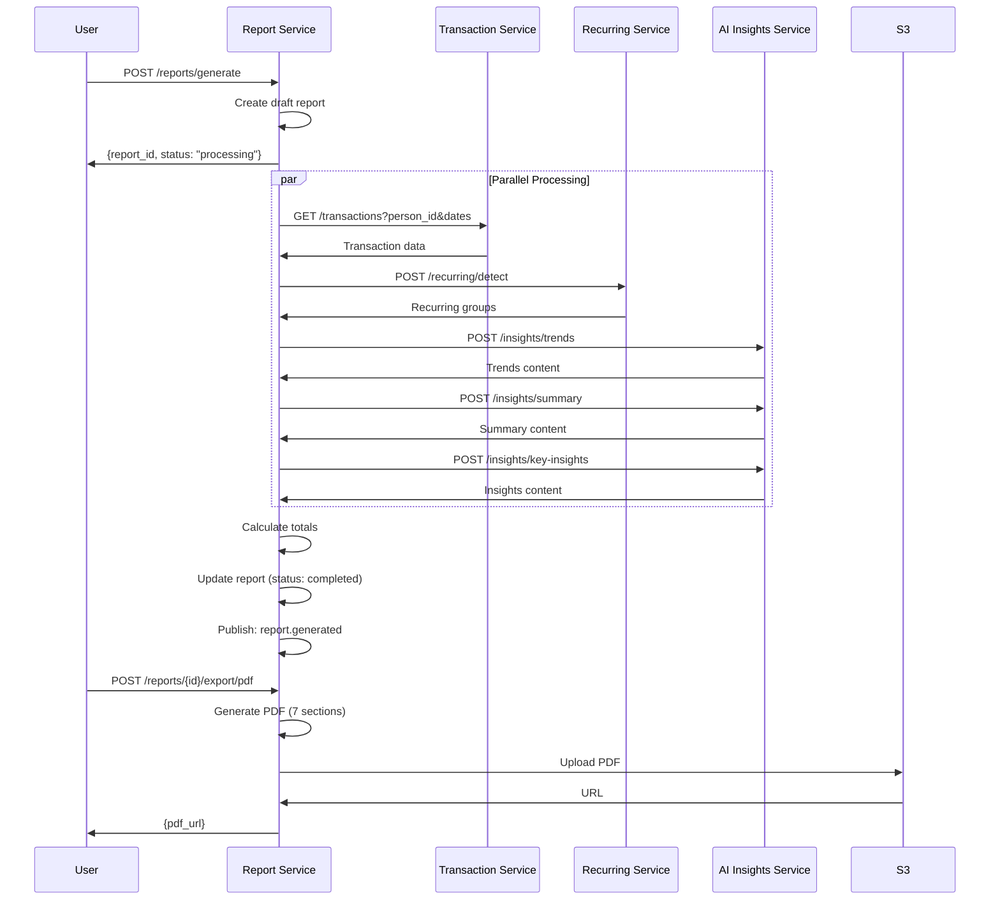

# Report Service - Solution Design

**Service**: PDF/Excel Report Generation  
**Port**: 8005  
**Repository**: `services/report-service/`

---

## Responsibility

- Orchestrate report generation
- Call downstream services (Recurring, Insights)
- Generate PDF (7 sections) & Excel exports
- Store reports in S3
- Manage report history

---

## API Endpoints

```
POST /reports/generate
  Body: {
    person_id: string,
    date_from: string,
    date_to: string,
    categories?: string[],  # Optional filter
    accounts?: string[]
  }
  Returns: { report_id, status: "processing" }

GET /reports/{id}
  Returns: {
    id, person_id, date_from, date_to,
    summary_takeaway, trends_content, insights_content,
    pdf_url, excel_url, status, created_at
  }

PUT /reports/{id}
  Body: {
    summary_takeaway?: string,  # User edits
    trends_content?: string,
    insights_content?: string
  }
  Returns: { success: true }

POST /reports/{id}/export/pdf
  Returns: { pdf_url, expires_in: 3600 }

POST /reports/{id}/export/excel
  Returns: { excel_url, expires_in: 3600 }

DELETE /reports/{id}
  Returns: { success: true }

GET /reports?person_id=...
  Returns: [{ id, date_from, date_to, created_at, pdf_url }]
```

---

## Data Model

### reports
```sql
CREATE TABLE reports (
  id UUID PRIMARY KEY DEFAULT gen_random_uuid(),
  person_id UUID NOT NULL,
  date_from DATE NOT NULL,
  date_to DATE NOT NULL,
  total_income DECIMAL(12,2),
  total_expenses DECIMAL(12,2),
  net_balance DECIMAL(12,2),
  summary_takeaway TEXT,
  trends_content TEXT,  # AI-generated, editable
  insights_content TEXT,  # AI-generated, editable
  recurring_detected_at TIMESTAMP,
  pdf_url TEXT,
  excel_url TEXT,
  status VARCHAR(20) DEFAULT 'draft',  # draft, processing, completed, failed
  error_message TEXT,
  created_at TIMESTAMP DEFAULT NOW(),
  updated_at TIMESTAMP DEFAULT NOW(),
  
  INDEX idx_person (person_id),
  INDEX idx_created (created_at)
);
```

---

## Dependencies

### Internal Services
- **Transaction Service** (get data)
- **Recurring Detection Service** (find patterns)
- **AI Insights Service** (generate content)

### External
- PostgreSQL (report schema)
- S3 (PDF/Excel storage)
- Event Bus

---

## Report Generation Flow



---

## PDF Structure (7 Sections)

### 1. Summary
```
Period: Nov 1 - Dec 31, 2025
Total Income: 45,540 AED
Total Expenses: 23,456 AED
Net Balance: 22,084 AED

Takeaway: [Editable paragraph]
```

### 2. Expense Overview
```
Top Categories:
1. Food & Dining: 5,678 AED (24%)
2. Groceries: 4,123 AED (18%)
...
[Simple bar chart]
```

### 3. Category Details
```
Food & Dining
- Total: 5,678 AED
- Transactions: 42
- Top merchants: Starbucks, Costa, Paul
```

### 4. Subscriptions & Recurring
```
Netflix: 49 AED/month (588 AED/year)
Spotify: 29 AED/month (348 AED/year)
[Flag forgotten: "Gym: Not seen in 60+ days" - yellow highlight]
```

### 5. Trends & Anomalies
```
• Spending spike in December (+45%)
• Coffee spending increased by 30%
• Large one-off: Furniture (3,500 AED)
[Max 5 bullets, AI-generated, editable]
```

### 6. Key Insights
```
• Your grocery spending was 4,123 AED (18% of total)
• Restaurant visits decreased compared to last period
• Subscription costs: 126 AED/month
[3-5 insights, plain language, NO advice]
```

### 7. Next Steps
```
Static guidance:
- Review top 2-3 categories for optimization opportunities
- Check recurring charges for unused subscriptions
- Re-run this report in a few months to track progress
```

---

## Implementation Details

### PDF Generation
```python
from weasyprint import HTML
from jinja2 import Template

def generate_pdf(report: Report) -> bytes:
    # Render HTML template
    template = Template(PDF_TEMPLATE)
    html = template.render(
        report=report,
        sections=[
            summary_section(report),
            expense_overview_section(report),
            category_details_section(report),
            recurring_section(report),
            trends_section(report),
            insights_section(report),
            next_steps_section()
        ]
    )
    
    # Convert to PDF
    pdf_bytes = HTML(string=html).write_pdf()
    return pdf_bytes
```

### Excel Generation
```python
from openpyxl import Workbook

def generate_excel(report: Report, transactions: List[Transaction]) -> bytes:
    wb = Workbook()
    ws = wb.active
    ws.title = "Transactions"
    
    # Headers
    ws.append(["Date", "Merchant", "Details", "Description", 
               "Category", "Amount", "Account"])
    
    # Data rows
    for txn in transactions:
        ws.append([
            txn.date.isoformat(),
            txn.merchant,
            txn.details,
            txn.description,
            txn.category,
            txn.amount_signed,
            txn.account
        ])
    
    return save_virtual_workbook(wb)
```

### Service Calls
```python
import httpx

async def get_transactions(person_id: str, date_from: str, date_to: str):
    async with httpx.AsyncClient() as client:
        response = await client.get(
            f"{TRANSACTION_SERVICE_URL}/transactions",
            params={
                "person_id": person_id,
                "start_date": date_from,
                "end_date": date_to
            }
        )
        return response.json()

async def detect_recurring(person_id: str, date_from: str, date_to: str):
    async with httpx.AsyncClient() as client:
        response = await client.post(
            f"{RECURRING_SERVICE_URL}/recurring/detect",
            json={
                "person_id": person_id,
                "date_from": date_from,
                "date_to": date_to
            }
        )
        return response.json()
```

---

## Performance

### Targets
- Report creation: < 2 minutes
- PDF generation: < 3 seconds
- Excel generation: < 2 seconds
- Parallel processing: Run recurring + insights concurrently

### Optimization
```python
import asyncio

async def generate_report_data(person_id, date_from, date_to):
    # Parallel execution
    transactions, recurring, trends, insights = await asyncio.gather(
        get_transactions(person_id, date_from, date_to),
        detect_recurring(person_id, date_from, date_to),
        generate_trends(person_id, date_from, date_to),
        generate_insights(person_id, date_from, date_to)
    )
    
    return {
        "transactions": transactions,
        "recurring": recurring,
        "trends": trends,
        "insights": insights
    }
```

---

## Events Published

```python
{
  "event": "report.generated",
  "report_id": "uuid",
  "person_id": "uuid",
  "date_from": "2025-11-01",
  "date_to": "2025-12-31",
  "status": "completed"
}

{
  "event": "report.exported",
  "report_id": "uuid",
  "format": "pdf",  # or "excel"
  "url": "s3://..."
}
```

---

## Technology

- **Framework**: FastAPI
- **PDF**: WeasyPrint or ReportLab
- **Excel**: openpyxl
- **Storage**: boto3 (S3)
- **HTTP Client**: httpx (async)
- **Event Bus**: aio-pika

---

## Testing

```python
@pytest.mark.asyncio
async def test_generate_report():
    # Mock service calls
    with patch('report_service.get_transactions') as mock_txn:
        mock_txn.return_value = sample_transactions
        
        response = await client.post("/reports/generate", json={
            "person_id": "test-person",
            "date_from": "2025-11-01",
            "date_to": "2025-12-31"
        })
        
        assert response.status_code == 200
        report_id = response.json()["report_id"]
        
        # Wait for processing
        await asyncio.sleep(2)
        
        report = await client.get(f"/reports/{report_id}")
        assert report.json()["status"] == "completed"
```

---

## Monitoring

### Metrics
- Report generation time (p50, p95, p99)
- Service call latencies
- PDF/Excel generation time
- S3 upload success rate
- Error rate by service dependency

---

**Status**: Ready for implementation  
**Owner**: Reporting Team  
**Dependencies**: Transaction Service, Recurring Service, AI Insights Service, S3


